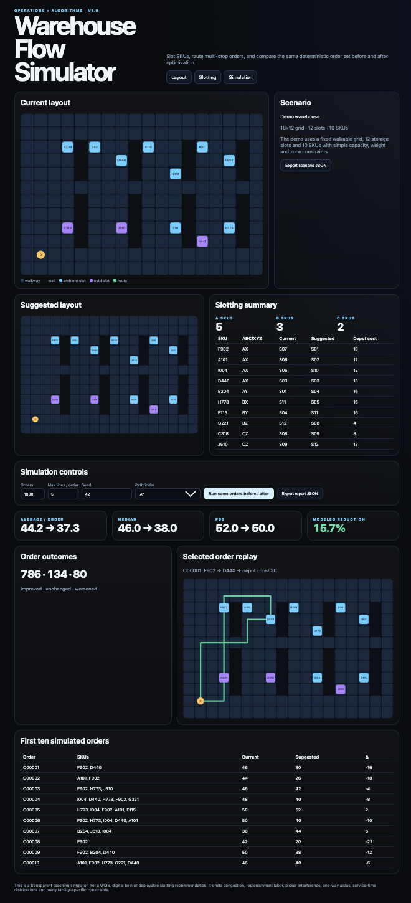

# Warehouse Flow Simulator

An end-to-end browser experiment that connects warehouse slotting with multi-stop order picking and shortest-path routing.

**Live demo:** https://dexter02-crypt.github.io/warehouse-flow-simulator/

**Latest published release:** [v1.0.1](https://github.com/dexter02-crypt/warehouse-flow-simulator/releases/tag/v1.0.1)



The screenshot records the original v1.0 example. The v1.0.1 maintenance release strengthened validation, bounded work, error handling and reproducible single-run reports while retaining the standard seed-42 result. The current v1.1.0 feature candidate adds bounded multi-seed robustness analysis. A local candidate is not deployed until it is reviewed, committed, pushed and successfully built.

## What it combines

The project combines concepts from [Warehouse Slotting Lab](https://github.com/dexter02-crypt/warehouse-slotting-lab) and [Route Craft](https://github.com/dexter02-crypt/route-craft-lab). Both remain independent repositories.

It validates a warehouse grid and a complete current allocation; classifies SKUs with ABC/XYZ; assigns them to compatible reachable slots; generates or reads an exact order list; routes each multi-stop order with a nearest-next sequence; and compares the same orders before and after slotting. A*, Dijkstra and bidirectional Dijkstra are available. Reported scores are weighted grid-entry costs, not metres, elapsed picking time or money saved.

## Run locally

Python 3.10+ and a modern browser are sufficient. Node.js 22+ is used for tests and report reproduction. No `pip install` or `npm install` is needed.

```bash
python3 serve.py
```

Keep Terminal running; Ctrl+C stops the loopback server. Use its printed URL rather than opening `index.html` as a file. `--no-open` leaves browser opening to you; `--port 0` selects a free port.

The local server serves only `ASSETS.json` paths, rejects directory listings, hidden files and symlinks, and checks the Host/Origin headers. It is a development server, not a production service. Its response-header policy does not automatically carry over to GitHub Pages.

## Run the full check

```bash
python3 -B tools/check.py
```

This verifies the prepared source inventory, syntax-checks JavaScript, runs the actual sorted Node test files with `shell=False`, runs the Python tooling/server tests, then checks the inventory again. An empty test directory or failing test is not accepted as success.

For intentionally edited development source, use `python3 -B tools/check.py --development`. That runs checks without claiming the edited source matches the prepared inventory. Rebuild/review the inventory deliberately before publishing new source; do not remove failing tests or silently bypass the normal release check.

`npm test` still runs the Node application tests only. The full check also covers the Python tools. The old initial-creation mode `python3 publish.py --public` is retired and refuses without invoking Git or GitHub. This repository already exists; use reviewed ordinary update commits later.

## Error handling and input boundaries

Settings changes invalidate old simulation metrics and disable report export. Invalid settings or a failed calculation show a visible error; a successful new run restores export. A scenario load/validation failure keeps calculation disabled and offers **Reload scenario** after correction.

Each SKU needs one distinct, compatible, depot-reachable slot. Current and suggested assignments are checked for occupancy, capacity, weight and zone. Slots are walkable **pick-access points**, not physical solid-rack footprints. Sparse arrays, invalid IDs, null/string/boolean numeric inputs, non-finite values and invalid seeds are rejected rather than coerced.

Orders: 1–10,000. Lines per order: 1–25. Seeds: integers 0–4,294,967,295. Grid: up to 48×32. Slots: up to 500. Individual demand/capacity quantities: at most 1e9. Scenario JSON: at most 1 MiB; exported report: at most 16 MiB. See the source and design notes for deterministic work/result bounds. A work-limit error is not a declaration of infeasibility.

The app continues to load `examples/warehouse-scenario.json`; it does not add a general upload form or a graphical layout editor. Exact orders already embedded in that scenario are now honored and generator controls are disabled. Otherwise it uses the displayed seed and settings. Seed 0 is no longer silently aliased to seed 1. Zero-demand SKUs are excluded when any positive demand exists; all-zero demand is sampled uniformly. Under extremely skewed demand, generation either completes the requested distinct lines or returns a clear work-limit error, never a silently shortened order.

## Reproduce an exported result

After a successful run, choose **Export report JSON**. The report contains the model/engine version, full scenario, exact orders, both allocations, settings and computed results, including the first order's paths.

```bash
node tools/reproduce-report.mjs "$HOME/Downloads/warehouse-flow-report.json"
```

The command reruns the calculation from the recorded inputs and compares the result. Success includes `"verified": true`. Inconsistent orders, allocations or results cause a nonzero exit. It does not upload or modify the file.

```bash
node tools/reproduce-demo.mjs
```

The standard 1,000-order, five-line, seed-42 A* case remains:

| Metric | Current | Suggested |
|---|---:|---:|
| Total cost | 44,194 | 37,266 |
| Mean cost | 44.194 | 37.266 |
| Median | 46 | 38 |
| P95 | 52 | 50 |

Outcomes: 786 improved, 134 unchanged, 80 worsened. Modeled reduction: about 15.7%.

Reproduction is **consistency checking, not a signature or proof of authorship**. An internally consistent, deliberately changed scenario can also produce a valid report. The timestamp is not an authenticated timestamp. Legacy v1.0 reports omitted necessary inputs and are not accepted by the new report verifier; regenerate them from a known scenario.

## Reproduce a robustness report

After a successful robustness run, choose **Export robustness JSON**.

```bash
node tools/reproduce-robustness.mjs "$HOME/Downloads/warehouse-flow-robustness-report.json"
```

The verifier regenerates every recorded seed with the deterministic order generator, recomputes every before/after comparison and checks both aggregate and per-seed results. Changed seed settings, assignments or results fail verification.

Multi-seed robustness analysis uses 2–20 consecutive deterministic seeds and is limited to 20,000 sampled orders across all seeds. It measures sensitivity inside this simulator; it is not a confidence interval, future-demand probability or real-world savings estimate.

## Model limitations

The activity-first slotter uses nearest compatible reachable slots. When a greedy choice blocks another SKU, an augmenting-path feasibility repair can reassign earlier choices. A complete feasible assignment is not a globally minimum-cost allocation. Nearest-next pick sequencing is also a heuristic; some orders may worsen. Neither method proves operational savings.

The browser yields between batches of 50 orders, but generation, validation and slotting still do bounded work on the main thread. Large/pathological inputs may be refused. There is no multi-picker model, congestion, replenishment labor, one-way aisles, physical equipment geometry or real-world calibration.

See [design](docs/DESIGN.md), [reliability review](docs/RELIABILITY.md) and [validation limits](docs/VALIDATION.md).

## License

MIT. Maintainer: Shikhar Singh. Third-party platform components retain their licenses; see [THIRD_PARTY.md](THIRD_PARTY.md).
